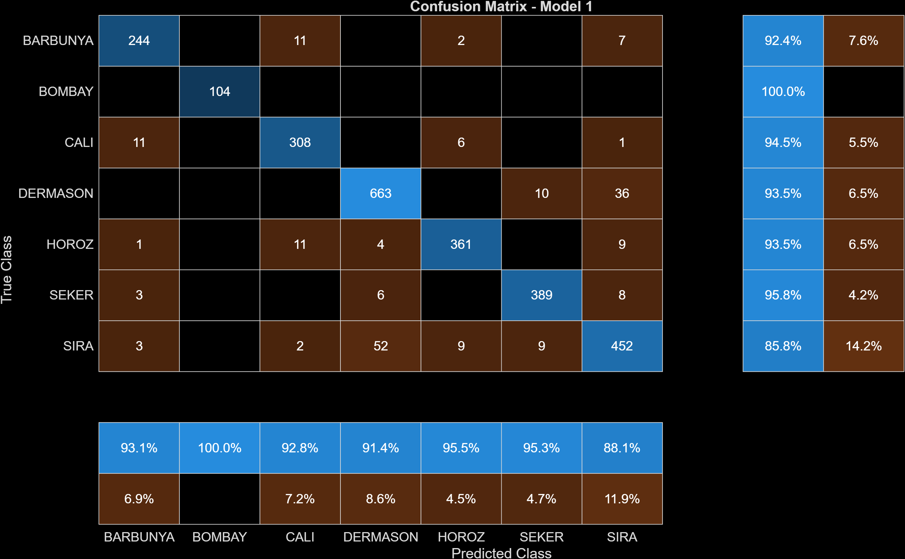

# Dry Bean Classification Project (Random Forest)

## Overview
This project applies a random forest classifier to a dry bean dataset in order to predict bean type based on geometric features. The dataset contains 13,611 observations across seven bean classes, with 16 numerical features describing size and shape properties.

---

## Deliverable #1 — Initial Prompt

I am working on a machine learning classification project based on a dry bean dataset. The dataset has 13,611 observations from seven different bean types and includes 16 numerical features that describe the geometric properties of each bean, such as area, perimeter, major and minor axis lengths, aspect ratio, eccentricity, compactness, and shape factors. The goal is to use these features to predict the bean class. I am implementing the project in MATLAB using the Statistics and Machine Learning Toolbox. I want to use a random forest classifier and understand why that method is a good fit for this kind of problem. I also need help understanding the workflow in MATLAB, including how to split the data into training and validation sets, train the model, and evaluate it with a confusion matrix. I want the explanation to focus on the reasoning behind each step, not just the code.

---

## Deliverable #2 — Random Forest Summary

A random forest is an ensemble learning method that builds many decision trees using different random subsets of the training data and features. Each tree makes a prediction, and the final classification is determined by a majority vote. This reduces overfitting and improves generalization.

This approach is well suited for this dataset because:
- The features are numerical and likely have nonlinear relationships with the output
- Many features are correlated (e.g., area, perimeter, axis lengths)
- The problem involves multiclass classification (7 bean types)

The workflow involves splitting the dataset into training and validation sets, training the model, and evaluating it using a confusion matrix. The confusion matrix allows us to assess accuracy and identify where misclassifications occur.

---

## Deliverable #3 — Model 1 (Baseline)

### Confusion Matrix — Model 1

```markdown



